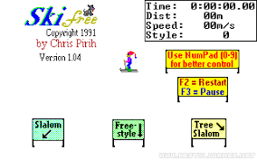
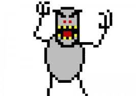

# 🏂SkiFree-Horizontal 
### Author: Logan Reese

## A personal implementation of SkiFree from '91👇

## Unity and C#

**Mechanics** 
- Move along horizontally
- Rotate forwards and backwards and land to increse score points
- Ability to speed up
- Particle effects that only play when touching the ground or the yeti gets you
- Finsih line that completes level and has to be crossed within the time limit
- Crash detection that takes away score and reduces time 

## Design

**Experience**
- Relaxing with false sense of security into panic upon poor performance 

**Core Mechanic**
- Do flips, get a minimum score and beat the clock or get eaten

**Game Loop**
- Cross the finsih line in time to progress/win